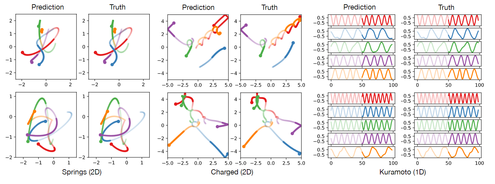
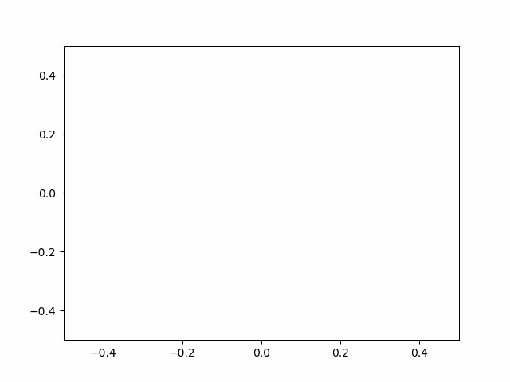
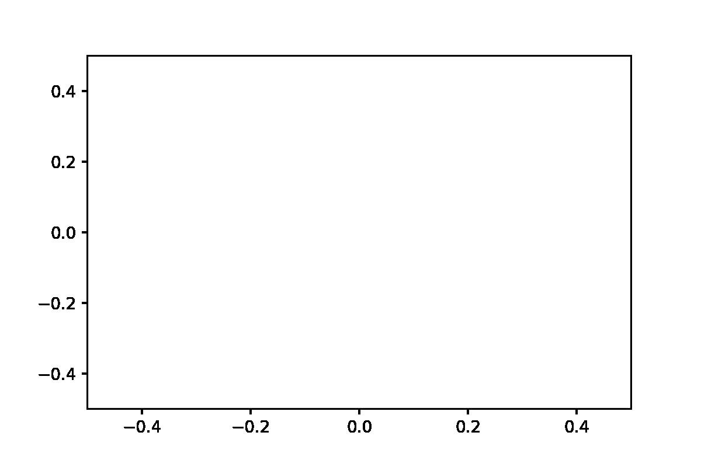

# 2022 - NRI

Reimplementation of the **N**eural **R**elation **I**nference proposed in the following paper: Kipf, Thomas, et al. "Neural relational inference for interacting systems." *International Conference on Machine Learning*. PMLR, 2018.
<p align="center">
<figure>

<figcaption align = "center"><b>Results figures in Neural Relational Inference for Interacting Systems</b></figcaption>
</figure>
</p>

## Prerequisites

Recommend using conda virtual environment. An `environment.yml` file has been set up. Simply run the following command to setup the required environment.

```
conda env create --name recoveredenv --file environment.yml
```

Next, create a local package (named `src`). Notice that `-e` indicates that the package is editable (no need to reinstall ) and `.` indicates the current folder. This approach takes the advantage of python package system. 

```
pip install -e.
```

Use `scripts/generate_dataset.py` to generate simulation data. You can use simulation data for both training and testing. All model input data will be saved in the `data` folder. In the `data` folder, we already provided two `.npy` files ONLY for testing.

## Model training and testing

Run the following code to train the encoder and the decoder respectively. 
The best model (among all epochs) is obtained through validation. The best model will then be tested.

```
/scripts$ python train_enc.py
/scripts$ python train_dec.py
```

You can further adjust training arguments. For details, use `python train_enc.py  -h`.

Notice that GPU is not necessary for training. You can train the model in a short time on a CPU platform. 

## Run demo

We provide `run_decoder.py` and `run_encoder.py` for generating trajectory based on trained model. The steps are the followings.

1. You can train a new model or use existing models. All trained models are saved in the folder `saved_model`. To use the model, specify the model path in the arguments of `run_decoder.py` and `run_encoder.py` correspondingly.
2. Specify datasets and network structural arguments in `run_decoder.py` and `run_encoder.py`. Run the script.
3. Run the script. The model output will be saved in the folder `saved_results`.
4. For decoder output, you can use `traj_plot.ipynb` to generate a gif visualization.

The visualization part of `run_encoder.py` is still under consideration. 

<table><tr>
<td> <figure>
 
</figure></td>
<td> <figure>
  
</figure></td>
</tr>
<tr>
  <td> <center>Ground truth trajectory</center></td>
  <td> <center>Prediction trajectory</center></td>
</tr>  
</table>

## TODOs

Appreciate any helps for the followings issues.

1. Test and add support for GPU platform. 
2. MLP building block has been implemented for the encoder and decoder. Consider other building blocks (e.g. CNN, RNN). To do this, implement other class inside `nri_decoder.py` and `nri_encoder.py`.
3. For data without ground truth edge information, we need to combine the encoder and the decoder together.
4. Visualization for encoder output result.

Any minor adjustments are also welcomed! 

The Github Actions test whether data can flow through the trained model.
You can use two test files in the `tests` folder. 
